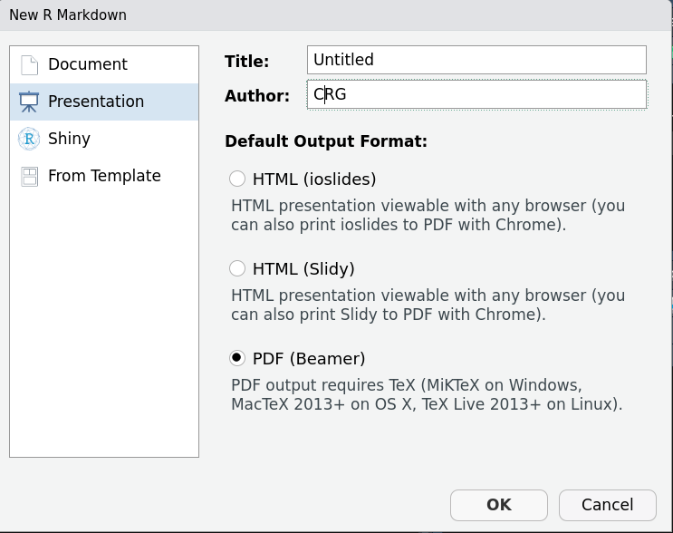

# Presentaciones Beamer

Presentaciones Beamer con R y Markdown. 

Creadas con (IDE) RStudio.

`File/New File/RMarkdown`

  

Algunos temas y colores en el siguiente link:

[Beamer theme gallery](http://deic.uab.es/~iblanes/beamer_gallery/)

Cada carpeta contiene un archivo pdf, de la presentación. Además de los archivos necesarios para ejecutar la presentación con RStudio.

[`Berkeley_theme`](https://github.com/riveracrist/Presentaciones_Beamer/blob/master/Berkeley_theme/tema_berkeley.pdf)

[`Berlin_theme`](https://github.com/riveracrist/Presentaciones_Beamer/blob/master/Berlin_theme/tema_berlin.pdf)

[`Hannover_theme`](https://github.com/riveracrist/Presentaciones_Beamer/blob/master/Hannover_theme/tema_hannover.pdf)

[`Madrid_theme`](https://github.com/riveracrist/Presentaciones_Beamer/blob/master/Madrid_theme/tema_madrid.pdf)

[`Marburg_theme`](https://github.com/riveracrist/Presentaciones_Beamer/blob/master/Marburg_theme/beamer1.pdf)

